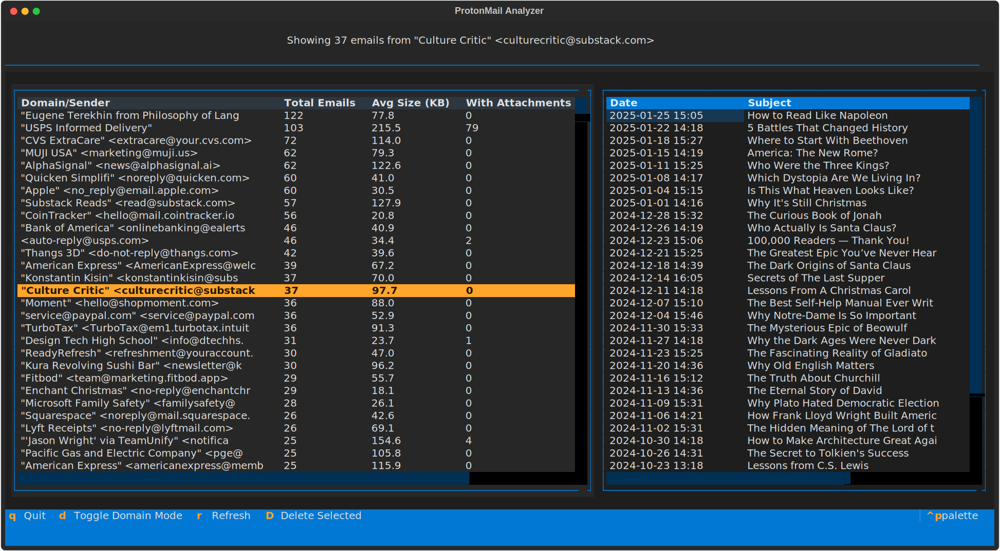
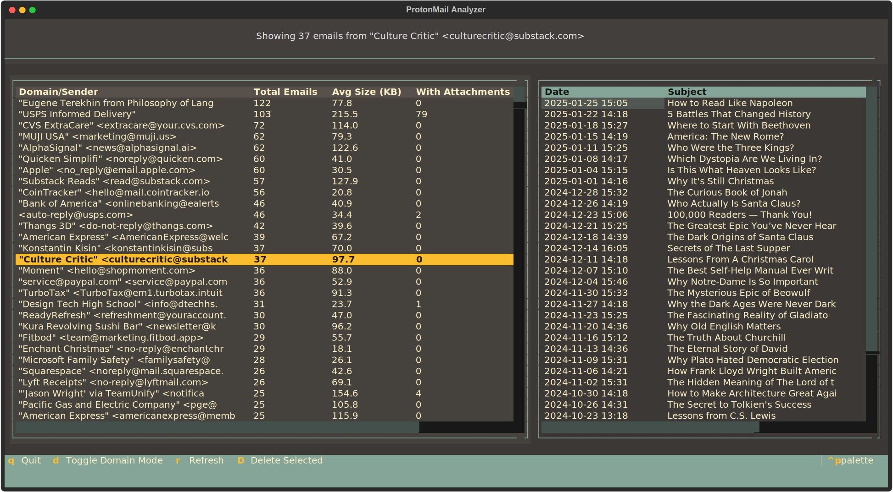
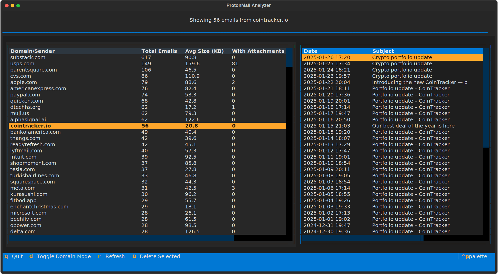

# Mail Processor

The Mail Processor helps you to find the most frequent senders in your email inbox and delete them. It was built to help me clean up my email inbox since one of my email clients are not that great at grouping by sender or by domain.





## Usage

Congigure email credentials in `proton.yaml` and run the script.
```yaml
credentials:
  username: "your_email@mail.com"
  password: "your_password"
server:
  host: "imap.mail.com"
  port: 993
```

And then run the script.
```bash
python email_grouper.py
```

It make a lot of time to run for the first time, so be patient.
