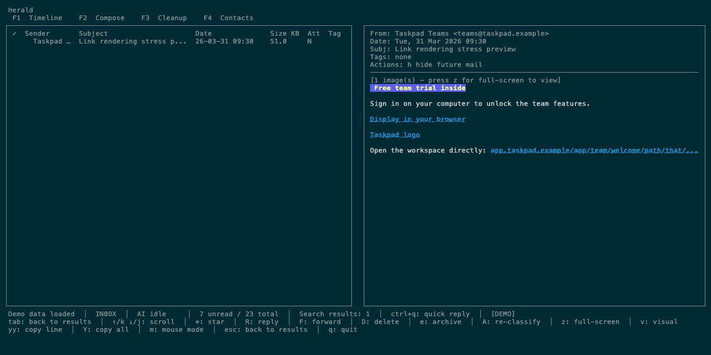

# Herald

**Fast terminal email for power users.** AI classification, semantic search, bulk cleanup, quick replies, and an MCP server for AI agents — all from your terminal.


Herald is keyboard-first, but it is not keyboard-only. Press `?` anywhere
Herald owns keyboard input to open context-sensitive shortcut help. In modern
terminals you can click the top tabs, folder/sidebar rows, Timeline and Cleanup
rows, and use the mouse wheel or trackpad to scroll lists and email previews.
Email links render as OSC 8 hyperlinks when your terminal supports them, so
readable labels like `Display in your browser` still open the real URL.



---

## Try The Demo First

Curious, but not ready to connect your inbox? Run Herald with a fictional mailbox, seeded contacts, attachments, threads, and deterministic demo AI:

```bash
herald --demo
# or, from a source checkout:
./bin/herald --demo
```

Demo mode does not open IMAP or SMTP, does not read your mailbox, and does not send anything to Ollama. Your real email is never loaded or shared.
For presentation captures, add `--demo-keys` to show a compact overlay of the keys being pressed.

To test terminal image rendering, run demo mode in a Kitty-protocol terminal such as Ghostty on macOS or Kitty itself, then open the Creative Commons image sampler email:

```bash
./bin/herald --demo -image-protocol=kitty
```

---

## Features

| Feature | Status |
|---------|--------|
| macOS Homebrew install + IMAP-first onboarding | ✅ |
| Standard IMAP + Gmail IMAP App Password setup | ✅ |
| IMAP presets: ProtonMail Bridge, Fastmail, iCloud, Outlook | ✅ |
| Experimental Gmail OAuth onboarding (`-experimental`) | ⚠️ |
| Chronological timeline with split-view email preview | ✅ |
| Terminal inline images via Kitty/Ghostty and iTerm2 full-screen previews | ✅ |
| Mouse navigation — clickable tabs, folder/list rows, scrollable previews, and OSC 8 links | ✅ |
| Bulk cleanup — delete by sender or domain in one keystroke | ✅ |
| AI classification via Ollama (gemma3, llama3, etc.) | ✅ |
| Semantic search with `nomic-embed-text-v2-moe` + chunked body embeddings | ✅ |
| Quick replies — 5 canned + 3 AI-generated suggestions (Ctrl+Q) | ✅ |
| Contact book with LLM enrichment and Apple Contacts import | ✅ |
| Compose + reply + forward with Markdown preview | ✅ |
| MCP server — AI agents read and manage email over stdio | ✅ |
| SSH server — run the full TUI over SSH | ✅ |
| IMAP IDLE push sync — new mail appears instantly | ✅ |


---

## Quick Start

### Prerequisites

- An IMAP account and SMTP settings, unless you run demo mode.
- Recommended: a modern terminal with mouse events and OSC 8 hyperlinks for clickable navigation and hardened email links. For inline image rendering, use a Kitty-protocol terminal such as Ghostty on macOS or Kitty itself; iTerm2 is also supported through its inline image protocol. Other terminals still get safe text placeholders or local `open image` links when available. See the [full OSC 8 adoption list](https://github.com/Alhadis/OSC8-Adoption/) for link support.
- For source builds only: Go 1.25 or newer and a C compiler such as `clang` or `gcc` for SQLite CGO support.

### macOS via Homebrew

```bash
brew tap herald-email/herald
brew install herald

# First launch shows setup wizard
herald
```

Homebrew is the default macOS install path. The formula installs `herald`,
whose `mcp` and `ssh` subcommands are the primary MCP and SSH entrypoints. It
also installs the compatibility wrappers `herald-mcp-server` and
`herald-ssh-server` for existing MCP configs and scripts. Release binaries
include the bundled Gmail OAuth defaults used when experimental OAuth
onboarding is explicitly enabled.

Update Homebrew metadata and upgrade Herald:

```bash
brew update
brew upgrade herald
```

For a full Homebrew reset:

```bash
brew uninstall herald
brew untap herald-email/herald
brew tap herald-email/herald
brew install herald
```

Direct browser downloads from GitHub are not Developer ID signed or notarized
yet, so macOS Gatekeeper may warn until the packaging milestone adds signing.

### Install from source with Go

```bash
# Install the primary CLI from source (Go 1.25+ required)
go install github.com/herald-email/herald-mail-app/cmd/herald@latest

# Or build from a checkout
git clone https://github.com/herald-email/herald-mail-app.git
cd herald-mail-app
make build

# Run (first launch shows setup wizard)
./bin/herald
```

The canonical Go install path is `github.com/herald-email/herald-mail-app/cmd/herald`;
it installs a binary named `herald`. Use `herald mcp` and `herald ssh` for the
MCP and SSH surfaces. The legacy wrapper packages remain installable only for
existing configs and scripts that still call the old binary names:

```bash
go install github.com/herald-email/herald-mail-app/cmd/herald-mcp-server@latest
go install github.com/herald-email/herald-mail-app/cmd/herald-ssh-server@latest
```

---

## Gmail Setup

Gmail IMAP with an App Password is the normal Gmail setup path while Gmail OAuth onboarding is experimental. The first-run wizard prefills `imap.gmail.com:993` and `smtp.gmail.com:587` for that path.

To configure Gmail over IMAP, turn on Google 2-Step Verification, create an App Password for Herald, then choose `Gmail (IMAP + App Password)` in the setup wizard.

Experimental OAuth onboarding is hidden from the first-run wizard unless Herald is launched with `-experimental`:

```bash
herald -experimental
```

If you choose `Gmail OAuth (Experimental)`, Herald opens a browser authorization prompt and stores the resulting refresh token in your config so it can refresh access later. OAuth remains gated because Google OAuth onboarding and verification can take weeks and significant cost.

Helpful references:

- [Google Workspace Help: Set up Gmail with a third-party email client](https://knowledge.workspace.google.com/admin/sync/set-up-gmail-with-a-third-party-email-client)
- [Gmail Help: Add Gmail to another email client](https://support.google.com/mail/answer/75726?hl=en)
- [Gmail Help: Sign in with app passwords](https://support.google.com/mail/answer/185833?hl=en)

Homebrew and release binaries include the desktop OAuth defaults used by the experimental Gmail OAuth wizard. Source builds do not embed those defaults unless you opt in.

For a one-off local run, export the credentials before launching Herald:

```bash
export HERALD_GOOGLE_CLIENT_ID="your-client-id.apps.googleusercontent.com"
export HERALD_GOOGLE_CLIENT_SECRET="your-client-secret"
```

For a local binary with OAuth defaults built in, copy `.herald-release.env.example` to `.herald-release.env`, fill it in, and run `make build-release-local`. Plain `make build` intentionally does not embed `.herald-release.env`; it creates a normal development binary.

---

## Configuration

Config file: `~/.herald/conf.yaml`

```yaml
credentials:
  username: "your@email.com"
  password: "your-password-or-app-password"
server:
  host: "imap.fastmail.com"
  port: 993
smtp:
  host: "smtp.fastmail.com"
  port: 587
ollama:
  host: "http://localhost:11434"
  model: "gemma3:4b"             # for classification, chat, quick replies
  embedding_model: "nomic-embed-text-v2-moe"  # for semantic search
```

Known server presets (auto-fill IMAP/SMTP): `gmail`, `protonmail`, `fastmail`, `icloud`, `outlook`

---

## Mouse And Clickable Links

Keyboard controls remain complete, but mouse users get the comfortable path too:

| Mouse action | Result |
|--------------|--------|
| Click a top tab | Switches to Timeline, Cleanup, or Contacts |
| Click a folder/sidebar row | Selects and opens that folder |
| Click a Timeline row | Opens the email preview for that message or thread |
| Scroll over Timeline or Cleanup rows | Moves through the list in small steps |
| Scroll over an email preview | Scrolls the message body |
| Click an OSC 8 email link | Opens the target URL through your terminal |

Press `m` in Timeline when you want terminal-native mouse text selection, then
press `m` again to restore Herald's mouse capture.

---

## MCP Setup

Herald exposes an MCP server over stdio through `herald mcp`, so AI tools can read and manage email without opening the TUI. The legacy `herald-mcp-server` binary remains available as a compatibility wrapper for older MCP configs.


```bash
go install github.com/herald-email/herald-mail-app/cmd/herald@latest

# Or build from a checkout:
go build -o bin/herald ./cmd/herald
```

Use `./bin/herald` instead of `herald` in the examples below when you are
testing the checkout binary directly.

### Claude Code

```
Add a local MCP server called "herald" that runs this command:
herald mcp -config ~/.herald/conf.yaml
```

Or run this from a source checkout:
```bash
claude mcp add herald -- "$(pwd)/bin/herald" mcp -config ~/.herald/conf.yaml
```

### Cursor

Add to `.cursor/mcp.json`:

```json
{
  "mcpServers": {
    "herald": {
      "command": "herald",
      "args": ["mcp", "-config", "~/.herald/conf.yaml"]
    }
  }
}
```

### Windsurf

Add to `~/.codeium/windsurf/mcp_config.json`:

```json
{
  "mcpServers": {
    "herald": {
      "command": "herald",
      "args": ["mcp", "-config", "~/.herald/conf.yaml"]
    }
  }
}
```

### Codex

```bash
CODEX_MCP_SERVERS='{"herald":{"command":"herald","args":["mcp","-config","~/.herald/conf.yaml"]}}' codex
```

### Generic (any stdio MCP client)

```bash
echo '{"jsonrpc":"2.0","id":1,"method":"tools/list"}' | herald mcp -config ~/.herald/conf.yaml
```

### MCP Readiness Checklist

The MCP server can answer cache-only questions after Herald has synced mail, but live IMAP/SMTP actions need the local daemon:

```bash
herald serve -config ~/.herald/conf.yaml
herald status
```

| Capability | Requirement |
|------------|-------------|
| Recent/unread/search/sender stats/classification reads | Open the TUI or run the daemon so the SQLite cache has synced mail. |
| Email body, summaries, action items, and draft replies | Open the email in the TUI first so its body text is cached. |
| Semantic search, summaries, classification, and action-item extraction | Configure an AI provider, such as Ollama, Claude, or OpenAI-compatible settings. |
| Sync, drafts, attachments, send/reply/forward, folder changes, and mail mutations | Start `herald serve` with the same `-config` used by the MCP server. |

If `herald serve` exits with `wildcard not at end`, upgrade Herald; older binaries had an invalid daemon route pattern for folder rename.

### Available MCP Tools

| Tool | Description |
|------|-------------|
| `list_recent_emails` | Most recent emails in a folder |
| `list_unread_emails` | Unread emails only |
| `search_emails` | Keyword search on sender + subject |
| `search_by_sender` | All emails from a sender or domain |
| `search_by_date` | Filter by date range |
| `semantic_search_emails` | Natural-language search via chunked body embeddings |
| `get_email_body` | Cached plain-text body |
| `get_sender_stats` | Senders ranked by email volume |
| `get_email_classifications` | AI category counts for a folder |
| `classify_email` | Run AI classification on one email |
| `summarise_email` | Generate a summary via Ollama |
| `list_contacts` | Paginated contact list |
| `search_contacts` | Keyword search on name/email/company/topics |
| `semantic_search_contacts` | Natural-language contact search |
| `get_contact` | Full profile + recent emails |

---

## Key Bindings

| Key | Action |
|-----|--------|
| `1` / `2` / `3` | Timeline / Cleanup / Contacts tab in browse contexts |
| `F1` / `F2` / `F3` | Timeline / Cleanup / Contacts tab from anywhere in the main TUI, including Compose |
| `Alt+1` / `Alt+2` / `Alt+3` | Secondary Timeline / Cleanup / Contacts aliases when the terminal sends Alt-modified digits |
| `C` | Open a new Compose screen from Timeline |
| `j` / `k` | Navigate down / up |
| `Enter` | Open email preview |
| `Escape` | Close preview / picker, or return from Compose to its originating Timeline screen |
| `D` | Delete selected email or sender |
| `e` | Archive |
| `R` | Reply |
| `F` | Forward |
| `Ctrl+Q` | Quick reply picker (in preview) |
| `u` | Unsubscribe |
| `z` | Full-screen preview |
| `S` | Open settings |
| `c` / `Alt+C` | Toggle AI chat panel (`Alt+C` also works while composing) |
| `a` | Run AI classification on current folder |
| `f` / `Alt+F` | Toggle folder sidebar (`Alt+F` also works while composing) |
| `l` / `Alt+L` | Toggle logs (`Alt+L` also works while composing) |
| `r` / `Alt+R` | Refresh current folder (`Alt+R` also works while composing) |
| `/` | Search; type `? query` inside search for semantic search when AI/embeddings are available |
| `?` | Open context-sensitive shortcut help |
| `q` | Quit in browse contexts only |
| `Ctrl+C` | Quit from any state, including text inputs |

---

## Run in Browser

Herald can run in a browser tab via [ttyd](https://github.com/nicholasgasior/ttyd):

```bash
brew install ttyd
ttyd -W ./bin/herald
```

Open [http://localhost:7681](http://localhost:7681). The `-W` flag makes the terminal writable (required for keyboard input). All key bindings work as in a normal terminal.

Options:

```bash
ttyd -W -p 8080 ./bin/herald                  # Custom port
ttyd -W -c user:pass ./bin/herald              # Basic auth
ttyd -W ./bin/herald --demo                    # Demo mode (no IMAP needed)
```

---

## Architecture

See [VISION.md](VISION.md) for the full feature roadmap and [ARCHITECTURE.md](ARCHITECTURE.md) for the technical design.

Long-form user and integration docs live in [docs/](docs/). Run them locally with `cd docs && npm run dev`.

## License

Herald is source-available under the Functional Source License, Version 1.1,
ALv2 Future License (`FSL-1.1-ALv2`). You may use, copy, modify, redistribute,
and run Herald for any permitted purpose other than a competing commercial use.

Each version converts to the Apache License, Version 2.0 on the second
anniversary of the date that version is made available, as described in
[LICENSE](LICENSE).
