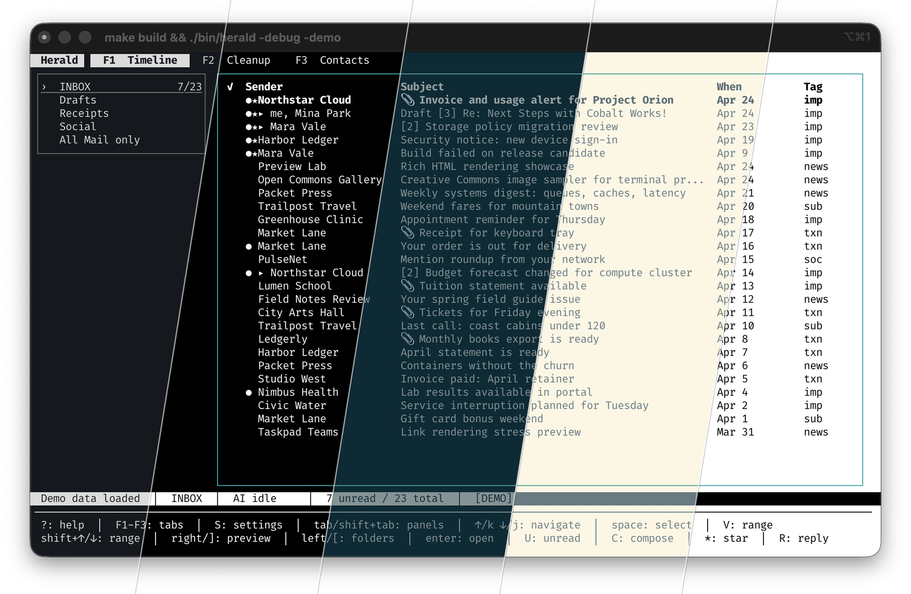

# Herald

> [!NOTE]
> Herald v0.6.2-beta.1 is the current beta: Gmail OAuth now uses Herald's Gmail API mail source, Calendar supports provider-backed create/edit/delete/RSVP and invitation import, previews gained safer images plus richer copy, and demo media covers the new workflows.

**Email and calendar in your terminal, without turning setup into a project.** Herald gives you a GUI-like, terminal-native workspace with mouse-friendly controls, full keyboard flow, and context help when you press `?`. Try demo mode before connecting an inbox; keep AI optional and local-first when you want classification, semantic search, quick replies, or chat; and use MCP or SSH when your terminal workflow wants to reach further.


Herald is keyboard-first, but it is not keyboard-only. Press `?` in browse and
non-text contexts to open context-sensitive shortcut help; editable Compose
fields keep literal `?` for writing. In modern
terminals you can click the top tabs, folder/sidebar rows, Timeline and
Contacts rows, and use the mouse wheel or trackpad to scroll lists and email previews.
Email links render as OSC 8 hyperlinks when your terminal supports them, so
readable labels like `Display in your browser` still open the real URL.


---

## Terminal Theme Inheritance

Herald now inherits your terminal palette instead of forcing one fixed look.
Switch your terminal theme and the TUI follows along, from low-light dark
palettes to bright paper-like setups.



Herald also ships a broader built-in app theme catalog. Try one without saving
config by passing `-theme` a built-in name or a local YAML theme file:

```bash
./bin/herald --demo -theme jade-signal
./bin/herald -config ~/.herald/conf.yaml -theme amber-furnace
./bin/herald --demo -theme ./my-theme.yaml
```

Theme screenshots for the docs gallery can be refreshed with:

```bash
scripts/regenerate-theme-screenshots.sh
HERALD_THEME_SCREENSHOT_VIEW=preview scripts/regenerate-theme-screenshots.sh jade-signal
```

---

## Try The Demo First

Curious, but not ready to connect your inbox? Run Herald with a fictional mailbox, seeded contacts, attachments, threads, and deterministic demo AI:

```bash
herald --demo
# or, from a source checkout:
./bin/herald --demo
```

Demo mode does not open IMAP or SMTP, does not read your mailbox, and does not send anything to Ollama. Your real email is never loaded or shared.
For presentation captures, add `--demo-keys` to show a compact overlay of the keys being pressed.

To test terminal image rendering, run demo mode in a Kitty-protocol terminal such as Ghostty on macOS or Kitty itself, then open the `Step 5: View inline images in full screen` Herald Image Lab email:

```bash
./bin/herald --demo -image-protocol=kitty
```

---

## Features

| Feature                                                                                   | Status |
| ----------------------------------------------------------------------------------------- | ------ |
| macOS Homebrew install + IMAP-first onboarding                                            | ✅     |
| Standard IMAP + Gmail IMAP App Password setup                                             | ✅     |
| IMAP presets: ProtonMail Bridge, Fastmail, iCloud, Outlook                                | ✅     |
| Gmail OAuth onboarding through the Gmail API mail source                                  | ✅     |
| Calendar workspace with Google Calendar OAuth, CalDAV, create/edit/delete, RSVP, and `.ics` import | ✅     |
| Reading-first Timeline with split/full previews and range selection                       | ✅     |
| Terminal inline images via Kitty/Ghostty and iTerm2 full-screen previews                  | ✅     |
| Opt-in remote image reveal, sanitized preview links, and rich preview copy                | ✅     |
| Mouse navigation — clickable tabs, folder/list rows, scrollable previews, and OSC 8 links | ✅     |
| Bulk cleanup — Timeline sender/domain grouping plus dry-run cleanup rule previews         | ✅     |
| Compact overlays for settings, shortcut help, cleanup rules, prompts, and previews        | ✅     |
| AI classification via Ollama (`gemma3:4b` default, custom models supported)               | ✅     |
| Semantic search with `nomic-embed-text-v2-moe` default + chunked body embeddings          | ✅     |
| Quick replies — 5 canned + 3 AI-generated suggestions (Ctrl+Q)                            | ✅     |
| Contact book with LLM enrichment and native Apple Contacts import                         | ✅     |
| Compose + reply + forward with Markdown preview, preserved context, and external editor   | ✅     |
| MCP server — AI agents read and manage email over stdio                                   | ✅     |
| SSH server — run the full TUI over SSH                                                    | ✅     |
| Privacy-safe logs by default, with `-unsafe-logs` for explicit local diagnostics           | ✅     |
| macOS notifications and `herald://mail/...` deep links where platform support exists      | ✅     |
| IMAP IDLE push sync — new mail appears instantly                                          | ✅     |


---

## Quick Start

### Prerequisites

- An IMAP account and SMTP settings, unless you run demo mode.
- Recommended: a modern terminal with mouse events and OSC 8 hyperlinks for clickable navigation and hardened email links. Common OSC 8-capable terminals include iTerm2, Kitty, WezTerm, GNOME Terminal and other VTE-based terminals, and Windows Terminal; see the [full OSC 8 adoption list](https://github.com/Alhadis/OSC8-Adoption/) for current compatibility. For inline image rendering, use a Kitty-protocol terminal such as Ghostty on macOS or Kitty itself; iTerm2 is also supported through its inline image protocol. Other terminals still get safe text placeholders or local `open image` links when available.
- For source builds only: Go 1.25 or newer and a C compiler such as `clang` or `gcc` for SQLite CGO support.

### macOS via Homebrew

```bash
brew tap herald-email/herald
brew install herald

# First launch shows setup wizard
herald
```

Homebrew is the default macOS install path. The formula installs `herald`,
whose `mcp` and `ssh` subcommands are the primary MCP and SSH entrypoints. It
also installs the compatibility wrappers `herald-mcp-server` and
`herald-ssh-server` for existing MCP configs and scripts. Release binaries
include the bundled Google OAuth defaults used by the recommended Gmail and
Google Calendar setup paths.

Update Homebrew metadata and upgrade Herald:

```bash
brew update
brew upgrade herald
```

For a full Homebrew reset:

```bash
brew uninstall herald
brew untap herald-email/herald
brew tap herald-email/herald
brew install herald
```

Direct browser downloads from GitHub are not Developer ID signed or notarized
yet, so macOS Gatekeeper may warn until the packaging milestone adds signing.

### Nightly Builds

Nightly builds are for testers who want the latest successful `main` build before the next beta tag. They are short-lived GitHub Actions artifacts, not signed releases, not Homebrew packages, and not guaranteed to be stable.

Download the latest nightly from GitHub:

1. Open [Actions > Nightly](https://github.com/herald-email/herald-mail-app/actions/workflows/nightly.yml).
2. Select the latest successful run.
3. Download the artifact for your Mac:
   - `herald-nightly-darwin-arm64` for Apple Silicon
   - `herald-nightly-darwin-amd64` for Intel
4. Unzip the artifact, verify the `.sha256` file if desired, then extract the included `.tar.gz`.

With the GitHub CLI:

```bash
run_id="$(gh run list --repo herald-email/herald-mail-app --workflow Nightly --limit 1 --json databaseId --jq '.[0].databaseId')"
gh run download "$run_id" --repo herald-email/herald-mail-app --name herald-nightly-darwin-arm64
```

Nightly artifacts expire after 14 days. Use Homebrew or beta releases for normal installation.

### Install from source with Go

```bash
# Install the primary CLI from source (Go 1.25+ required)
go install github.com/herald-email/herald-mail-app/cmd/herald@latest

# Or build from a checkout
git clone https://github.com/herald-email/herald-mail-app.git
cd herald-mail-app
make build

# Run (first launch shows setup wizard)
./bin/herald
```

The canonical Go install path is `github.com/herald-email/herald-mail-app/cmd/herald`;
it installs a binary named `herald`. Use `herald mcp` and `herald ssh` for the
MCP and SSH surfaces. The legacy wrapper packages remain installable only for
existing configs and scripts that still call the old binary names:

```bash
go install github.com/herald-email/herald-mail-app/cmd/herald-mcp-server@latest
go install github.com/herald-email/herald-mail-app/cmd/herald-ssh-server@latest
```

---

## Gmail Setup

Gmail OAuth is the recommended Gmail setup path. Herald opens a browser authorization prompt, validates selected Google access, and stores a Gmail API mail source so sync, body reads, drafts, mailbox mutations, and send use Google's API instead of IMAP.

To configure Gmail with OAuth, choose `Gmail OAuth` in the setup wizard and complete the browser flow.

As a fallback, you can still configure Gmail over IMAP by turning on Google 2-Step Verification, creating an App Password for Herald, then choosing `Gmail (IMAP + App Password)` in the setup wizard. That path prefills `imap.gmail.com:993` and `smtp.gmail.com:587`.

Helpful references:

- [Google Workspace Help: Set up Gmail with a third-party email client](https://knowledge.workspace.google.com/admin/sync/set-up-gmail-with-a-third-party-email-client)
- [Gmail Help: Add Gmail to another email client](https://support.google.com/mail/answer/75726?hl=en)
- [Gmail Help: Sign in with app passwords](https://support.google.com/mail/answer/185833?hl=en)

Homebrew and release binaries include the desktop OAuth defaults used by Google OAuth. Source builds embed development OAuth defaults from `.herald-dev.env` when both Google OAuth variables are present, and otherwise keep building without OAuth defaults.

For a one-off local run, export the credentials before launching Herald:

```bash
export HERALD_GOOGLE_CLIENT_ID="your-client-id.apps.googleusercontent.com"
export HERALD_GOOGLE_CLIENT_SECRET="your-client-secret"
```

For a local binary with OAuth defaults built in, copy `.herald-dev.env.example` to `.herald-dev.env`, fill it in, and run `make build`. Use `.herald-release.env` plus `make build-release-local` when you want release-style strictness; it fails early if either OAuth value is missing.

---

## Configuration

Config file: `~/.herald/conf.yaml`

```yaml
credentials:
    username: "your@email.com"
    password: "your-password-or-app-password"
server:
    host: "imap.fastmail.com"
    port: 993
smtp:
    host: "smtp.fastmail.com"
    port: 587
ollama:
    host: "http://localhost:11434"
    model: "gemma3:4b" # for classification, chat, quick replies
    embedding_model: "nomic-embed-text-v2-moe" # for semantic search
```

Known server presets (auto-fill IMAP/SMTP): `gmail`, `protonmail`, `fastmail`, `icloud`, `outlook`

---

## Mouse And Clickable Links

Keyboard controls remain complete, but mouse users get the comfortable path too:

| Mouse action                         | Result                                             |
| ------------------------------------ | -------------------------------------------------- |
| Click a top tab                      | Switches to Timeline, Contacts, or Calendar        |
| Click a folder/sidebar row           | Selects and opens that folder                      |
| Click a Timeline row                 | Opens the email preview for that message or thread |
| Scroll over Timeline or Calendar rows | Moves through the list in small steps             |
| Scroll over an email preview         | Scrolls the message body                           |
| Click an OSC 8 email link            | Opens the target URL through your terminal         |

Press `m` in Timeline when you want terminal-native mouse text selection, then
press `m` again to restore Herald's mouse capture.

---

## MCP Setup

Herald exposes an MCP server over stdio through `herald mcp`, so AI tools can read and manage email without opening the TUI. The legacy `herald-mcp-server` binary remains available as a compatibility wrapper for older MCP configs.


```bash
go install github.com/herald-email/herald-mail-app/cmd/herald@latest

# Or build from a checkout:
go build -o bin/herald ./cmd/herald
```

Use `./bin/herald` instead of `herald` in the examples below when you are
testing the checkout binary directly.

### Claude Code

```
Add a local MCP server called "herald" that runs this command:
herald mcp -config ~/.herald/conf.yaml
```

Or run this from a source checkout:

```bash
claude mcp add herald -- "$(pwd)/bin/herald" mcp -config ~/.herald/conf.yaml
```

### Cursor

Add to `.cursor/mcp.json`:

```json
{
    "mcpServers": {
        "herald": {
            "command": "herald",
            "args": ["mcp", "-config", "~/.herald/conf.yaml"]
        }
    }
}
```

### Windsurf

Add to `~/.codeium/windsurf/mcp_config.json`:

```json
{
    "mcpServers": {
        "herald": {
            "command": "herald",
            "args": ["mcp", "-config", "~/.herald/conf.yaml"]
        }
    }
}
```

### Codex

```bash
CODEX_MCP_SERVERS='{"herald":{"command":"herald","args":["mcp","-config","~/.herald/conf.yaml"]}}' codex
```

### Generic (any stdio MCP client)

```bash
echo '{"jsonrpc":"2.0","id":1,"method":"tools/list"}' | herald mcp -config ~/.herald/conf.yaml
```

### MCP Readiness Checklist

The MCP server can answer cache-only questions after Herald has synced mail, but live IMAP/SMTP actions need the local daemon:

```bash
herald serve -config ~/.herald/conf.yaml
herald status
```

| Capability                                                                          | Requirement                                                                      |
| ----------------------------------------------------------------------------------- | -------------------------------------------------------------------------------- |
| Recent/unread/search/sender stats/classification reads and cleanup dry-run previews | Open the TUI or run the daemon so the SQLite cache has synced mail.              |
| Email body, summaries, action items, and draft replies                              | Open the email in the TUI first so its body text is cached.                      |
| Semantic search, summaries, classification, and action-item extraction              | Configure an AI provider, such as Ollama, Claude, or OpenAI-compatible settings. |
| Sync, drafts, attachments, send/reply/forward, folder changes, and mail mutations   | Start `herald serve` with the same `-config` used by the MCP server.             |

If `herald serve` exits with `wildcard not at end`, upgrade Herald; older binaries had an invalid daemon route pattern for folder rename.

### Selected MCP Tools

The full tool catalog is in the [MCP docs](docs/src/content/docs/advanced/mcp.md). Common cache-backed tools work after sync; live mutation tools need `herald serve`.

| Tool                        | Description                                         |
| --------------------------- | --------------------------------------------------- |
| `list_recent_emails`        | Most recent emails in a folder                      |
| `list_unread_emails`        | Unread emails only                                  |
| `search_emails`             | Keyword search on sender + subject                  |
| `search_by_sender`          | All emails from a sender or domain                  |
| `search_by_date`            | Filter by date range                                |
| `semantic_search_emails`    | Natural-language search via chunked body embeddings |
| `get_email_body`            | Cached plain-text body                              |
| `get_sender_stats`          | Senders ranked by email volume                      |
| `get_email_classifications` | AI category counts for a folder                     |
| `classify_email`            | Run AI classification on one email                  |
| `summarise_email`           | Generate a summary via Ollama                       |
| `dry_run_cleanup_rules`     | Preview cleanup rule matches without mutating mail  |
| `run_cleanup_rules`         | Run enabled cleanup rules through the daemon        |
| `list_contacts`             | Paginated contact list                              |
| `search_contacts`           | Keyword search on name/email/company/topics         |
| `semantic_search_contacts`  | Natural-language contact search                     |
| `get_contact`               | Full profile + recent emails                        |

---

## Key Bindings

| Key                                | Action                                                                                      |
| ---------------------------------- | ------------------------------------------------------------------------------------------- |
| `1` / `2` / `3`                    | Timeline / Contacts / Calendar tabs in browse contexts                                      |
| `F1` / `F2` / `F3` / `F4`          | Timeline / Contacts / Contacts legacy / Calendar aliases                                    |
| `Ctrl+N` (`c` legacy)              | Open a new Compose screen from Timeline                                                     |
| `Ctrl+X`                           | Open the Compose body in `$VISUAL` or `$EDITOR`                                             |
| `h` / `j` / `k` / `l`              | Navigate left / down / up / right where the active pane supports it                         |
| `Enter`                            | Open email preview                                                                          |
| `Space`                            | Select Timeline messages or grouped sender/domain rows                                      |
| `Shift+Up` / `Shift+Down`          | Extend Timeline range selection when supported by the terminal                              |
| `V`, then `j` / `k`                | Fallback Timeline range selection without shifted-arrow support                             |
| `Escape`                           | Close preview / picker, or return from Compose to its originating Timeline screen           |
| `Delete` (`d` / `Backspace` legacy) | Delete selected/current target after confirmation                                          |
| `Shift+Delete` (`D` / `Shift+Backspace` legacy) | Delete selected/current target immediately, without confirmation                  |
| `A` (`E` legacy alias)             | Archive current message immediately; bulk archive still asks for confirmation               |
| `Ctrl+R` / `Ctrl+Shift+R`          | Reply sender-only / reply all                                                               |
| `Ctrl+F`                           | Forward                                                                                     |
| `T`                                | Re-classify the current message with AI in Default                                          |
| `Ctrl+Q`                           | Quick reply picker (in preview)                                                             |
| `u`                                | Unsubscribe                                                                                 |
| `H`                                | Hide future mail from the current sender                                                    |
| `z`                                | Full-screen preview                                                                         |
| `S`                                | Open settings as a compact overlay, including Sync & Cleanup managers                       |
| `p` / `r` in Cleanup manager       | Preview selected cleanup rule or all enabled cleanup rules                                  |
| `s` / `E` / `R` in dry-run preview | Save disabled, enable after confirmation, or run previewed cleanup live                     |
| `B`                                | Toggle folder sidebar                                                                       |
| `g`                                | Toggle the AI chat panel                                                                    |
| `L`                                | Toggle logs                                                                                 |
| `Ctrl+R` outside Timeline mail contexts | Refresh current folder                                                                  |
| `/` / `Ctrl+K`                     | Contextual search; in mailbox search type `? query` for semantic search when available      |
| `?`                                | Open context-sensitive shortcut help outside editable text fields                            |
| `F6` / `Shift+F6`                  | Cycle pane focus forward/backward (`Tab` / `Shift+Tab` remain aliases)                      |
| `Alt+A`                            | Open the account switcher in Default browse contexts when multiple accounts exist           |
| `q`                                | Quit in browse contexts only                                                                |
| `Ctrl+C`                           | Quit from any state, including text inputs                                                  |

Keyboard behavior is configurable:

```yaml
keyboard:
  profile: default # default | vim | emacs | custom
  custom_keymap: ~/.config/herald/keymaps/work.yaml
```

Custom keymap files extend a built-in profile and bind keys to Herald command IDs. Default shows preferred GUI-mail-style shortcuts in the bottom hint bar while keeping legacy aliases active; Vim keeps terminal-oriented primaries. Add `fields.compose.default_mode: normal` when a custom map should opt Compose into Vim-style field modes; otherwise Compose, search, prompt, settings, and editor-like text fields keep literal printable input, including `?`, `/`, and macOS Option-generated characters.

---

## Run in Browser

Herald can run in a browser tab via [ttyd](https://github.com/nicholasgasior/ttyd):

```bash
brew install ttyd
ttyd -W ./bin/herald
```

Open [http://localhost:7681](http://localhost:7681). The `-W` flag makes the terminal writable (required for keyboard input). All key bindings work as in a normal terminal.

Options:

```bash
ttyd -W -p 8080 ./bin/herald                  # Custom port
ttyd -W -c user:pass ./bin/herald              # Basic auth
ttyd -W ./bin/herald --demo                    # Demo mode (no IMAP needed)
```

---

## Architecture

See [VISION.md](VISION.md) for the full feature roadmap and [ARCHITECTURE.md](ARCHITECTURE.md) for the technical design.

Long-form user and integration docs live in [docs/](docs/). Run them locally with `cd docs && npm run dev`.

## License

Herald is source-available under the Functional Source License, Version 1.1,
ALv2 Future License (`FSL-1.1-ALv2`). You may use, copy, modify, redistribute,
and run Herald for any permitted purpose other than a competing commercial use.

Each version converts to the Apache License, Version 2.0 on the second
anniversary of the date that version is made available, as described in
[LICENSE](LICENSE).
