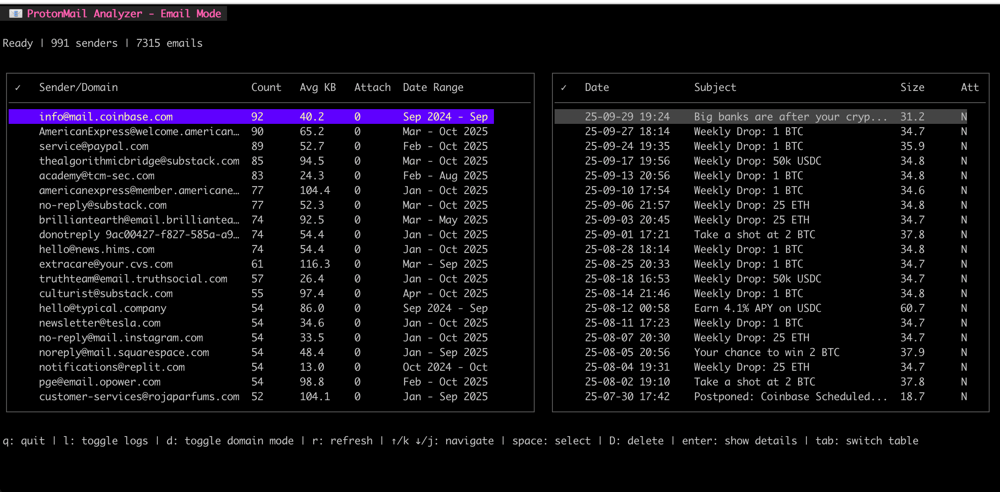

# Mail Processor

A terminal-based email client and inbox cleanup tool written in Go, connecting to IMAP servers (primarily ProtonMail Bridge). Helps you identify and delete frequent email senders, manage subscriptions, and keep your inbox clean.



## Features

- **Fast**: Built in Go — low memory footprint, quick startup
- **Beautiful TUI**: Modern terminal interface using Bubble Tea
- **Smart Caching**: SQLite-based caching for faster subsequent runs
- **Email Grouping**: Group by sender or domain for bulk analysis
- **Interactive Selection**: Select individual messages across multiple senders
- **Async Deletion**: Non-blocking deletion with progress feedback
- **Move to Trash**: Safely moves emails to Trash instead of permanent deletion
- **Real-time Logs**: Toggle log view to monitor operations
- **Cross-platform**: Works on Linux, macOS, and Windows

## Quick Start

### Download Pre-built Binary

Download the latest release for your platform from [GitHub Releases](https://github.com/zoomacode/mail-processor/releases):

- **Linux**: `mail-processor_vX.X.X_Linux_x86_64.tar.gz` or `mail-processor_vX.X.X_Linux_arm64.tar.gz`
- **macOS Intel**: `mail-processor_vX.X.X_Darwin_x86_64.tar.gz`
- **macOS Apple Silicon**: `mail-processor_vX.X.X_Darwin_arm64.tar.gz`
- **Windows**: `mail-processor_vX.X.X_Windows_x86_64.zip`

Extract and run:
```bash
# Linux/macOS
tar -xzf mail-processor_*.tar.gz
./mail-processor

# Windows
# Extract the .zip file and run mail-processor.exe
```

### Build from Source

**Prerequisites**: Go 1.23 or higher, GCC/Clang (required for SQLite CGO)

```bash
# Clone the repository
git clone https://github.com/zoomacode/mail-processor.git
cd mail-processor

# Build
make build

# Run
./bin/mail-processor
```

## Configuration

Create a `proton.yaml` file in the same directory as the executable:

```yaml
credentials:
  username: "your_email@mail.com"
  password: "your_password"
server:
  host: "127.0.0.1"  # ProtonMail Bridge (or your IMAP server)
  port: 1143         # Default ProtonMail Bridge port (use 993 for standard IMAP)
```

**Security Note**: Set proper file permissions:
```bash
chmod 600 proton.yaml
```

## Usage

### Run the Application
```bash
# Basic usage
./bin/mail-processor

# With debug logging
./bin/mail-processor -debug

# Custom config file
./bin/mail-processor -config /path/to/config.yaml

# Show help
./bin/mail-processor -help
```

### Keyboard Shortcuts

| Key | Action |
|-----|--------|
| `q` | Quit application |
| `l` | Toggle real-time logs view |
| `d` | Toggle domain/sender grouping mode |
| `r` | Refresh email data |
| `↑/k` `↓/j` | Navigate up/down |
| `tab` | Switch between tables |
| `space` | Toggle selection (multi-select) |
| `D` | Delete selected emails/senders |
| `enter` | Focus details table |

### Features in Action

**Left Table**: Shows senders grouped by email or domain
- Shows total email count, average size, attachments
- Select multiple senders with `space`
- Press `D` to delete all emails from selected senders

**Right Table**: Shows individual emails from selected sender
- Select individual messages with `space` (across multiple senders)
- Press `D` to delete selected individual messages

**Async Deletion**:
- Deletions run in background queue
- Status line shows current deletion progress
- UI remains responsive - you can quit anytime with `q`

**Real-time Logs**: Press `l` to toggle log view
- Monitor IMAP operations
- See cache statistics
- Debug connection issues

## Architecture

### Key Components

1. **IMAP Client** ([internal/imap/](internal/imap/)) - Handles email server communication
2. **Cache System** ([internal/cache/](internal/cache/)) - SQLite-based email metadata storage
3. **TUI Interface** ([internal/app/](internal/app/)) - Bubble Tea-based user interface
4. **Configuration** ([internal/config/](internal/config/)) - YAML config file handling
5. **Models** ([internal/models/](internal/models/)) - Data structures and types

### Performance Features

- **Concurrent Processing**: Efficient goroutine usage for email processing
- **Smart Caching**: Only processes new emails on subsequent runs
- **Memory Efficient**: Streams email data rather than loading everything
- **Async Operations**: Non-blocking deletion queue with worker goroutines

### Security Features

- **Secure Deletion**: Moves to Trash folder instead of permanent deletion
- **Message-ID Based**: Uses IMAP Message-ID for reliable deletion
- **Input Validation**: All email data is validated before processing
- **Secure Connections**: TLS encryption for IMAP connections
- **Config Security**: File permission checks for credential files

## Development

### Project Structure
```
.
├── main.go                 # Application entry point
├── internal/
│   ├── app/               # TUI application logic
│   │   ├── app.go         # Main app model and Update loop
│   │   ├── helpers.go     # Helper functions and workers
│   │   └── logs.go        # Log viewer component
│   ├── cache/             # SQLite caching
│   │   └── cache.go       # Cache implementation
│   ├── config/            # Configuration handling
│   │   └── config.go      # Config parsing
│   ├── imap/              # IMAP client
│   │   ├── client.go      # IMAP operations
│   │   └── delete.go      # Email deletion (Message-ID based)
│   ├── logger/            # Logging system
│   │   └── logger.go      # Structured logging
│   └── models/            # Data models
│       └── email.go       # Email structures
├── go.mod                 # Go modules
├── Makefile              # Build automation
└── proton.yaml           # Configuration file
```

### Development Commands

```bash
# Install dependencies
make deps

# Format code
make fmt

# Run linter
make vet

# Run tests
make test

# Build
make build

# Run
make run
```

### Building for Multiple Platforms

Releases are automated via GitHub Actions using GoReleaser. To create a release:

```bash
git tag v1.0.0
git push origin v1.0.0
```

This will automatically build and publish binaries for:
- Linux (amd64, arm64)
- macOS (amd64, arm64)
- Windows (amd64)

## Dependencies

- [Bubble Tea](https://github.com/charmbracelet/bubbletea) - TUI framework
- [Lipgloss](https://github.com/charmbracelet/lipgloss) - Terminal styling
- [Bubbles](https://github.com/charmbracelet/bubbles) - TUI components (table)
- [go-imap](https://github.com/emersion/go-imap) - IMAP client library
- [go-sqlite3](https://github.com/mattn/go-sqlite3) - SQLite driver
- [yaml.v3](https://github.com/go-yaml/yaml) - Configuration parsing

## Troubleshooting

### Common Issues

**Connection Failed**:
- Check ProtonMail Bridge is running
- Verify host/port in `proton.yaml`
- Check firewall settings

**Permission Denied**:
- Ensure config file has correct permissions: `chmod 600 proton.yaml`

**SQLite Error**:
- Check disk space
- Verify file permissions on `email_cache.db`

**Deletion Not Working**:
- Check logs with `l` key
- Verify Trash folder exists on IMAP server
- Check IMAP server permissions

### Debugging

Enable debug logging:
```bash
./bin/mail-processor -debug
```

Monitor log files:
```bash
tail -f mail_processor_*.log
```

Or use the built-in log viewer by pressing `l` in the TUI.

## Contributing

1. Fork the repository
2. Create a feature branch
3. Make your changes
4. Run tests: `make test`
5. Submit a pull request

## License

MIT License - see LICENSE file for details
