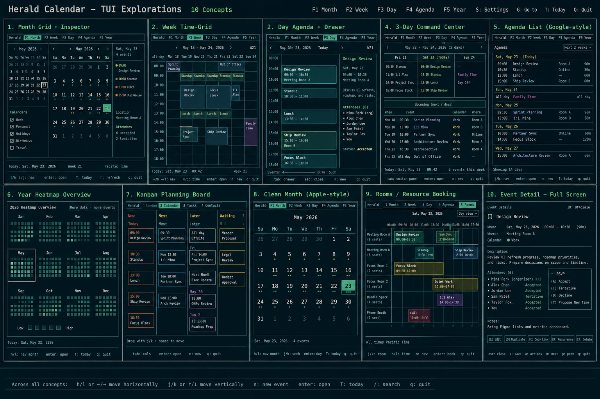
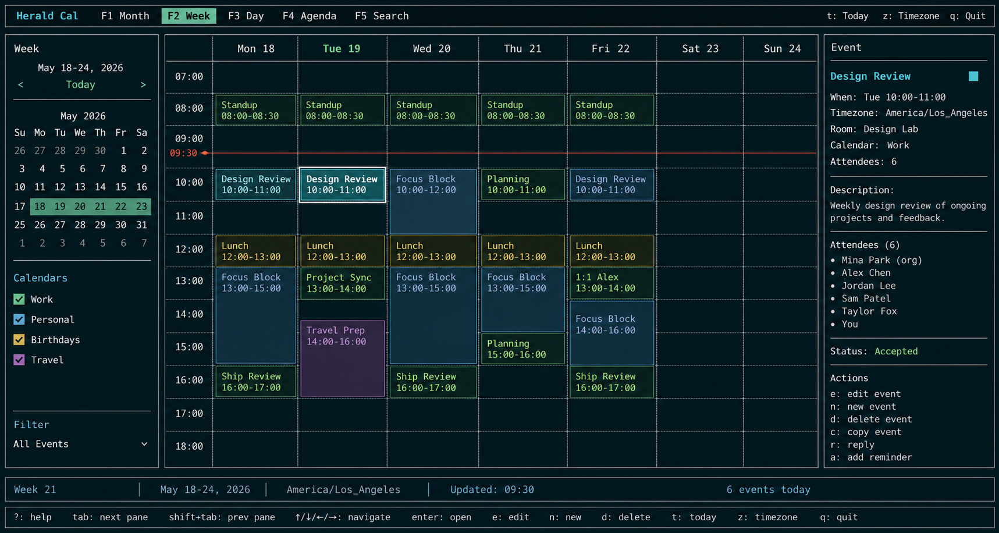
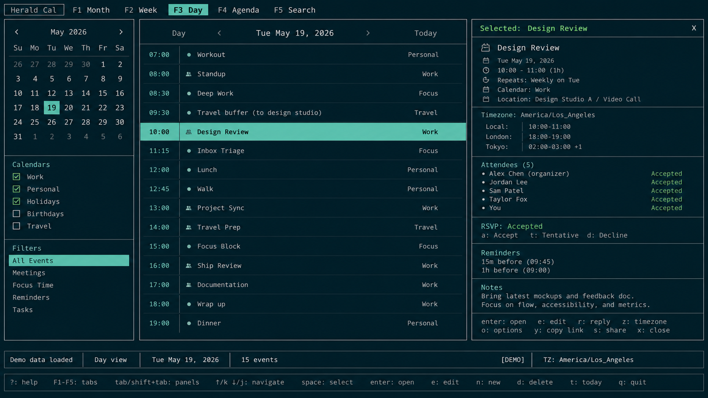
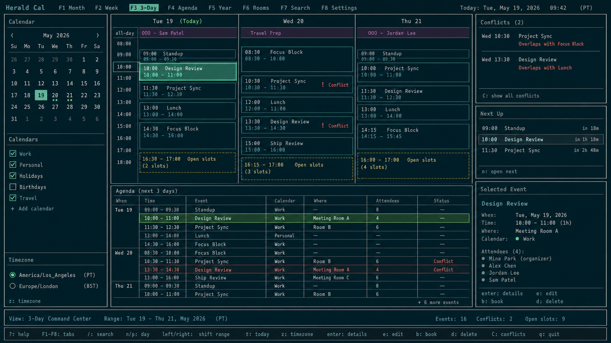
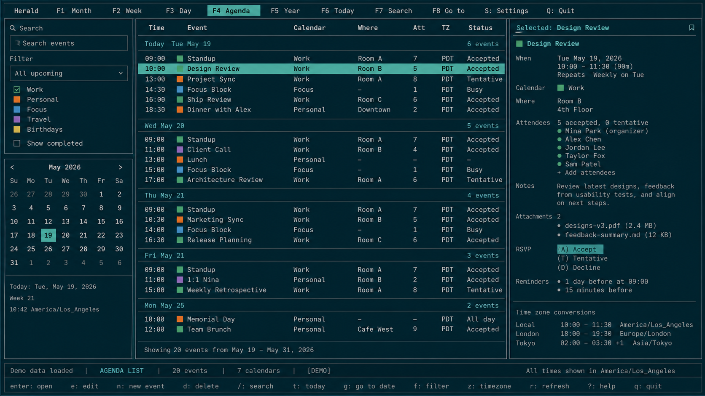
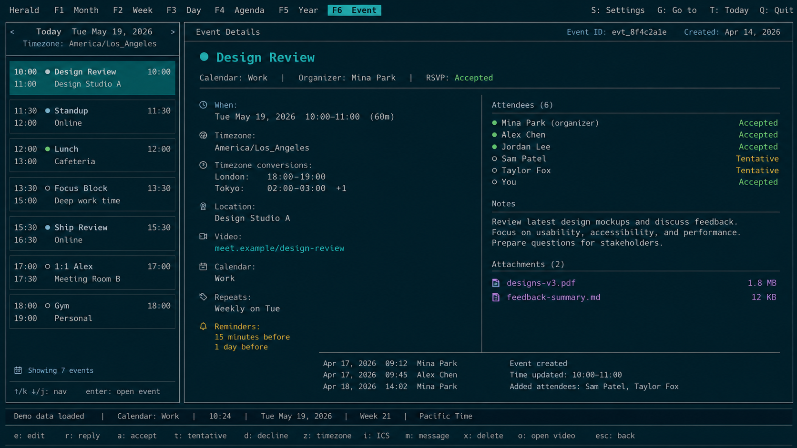
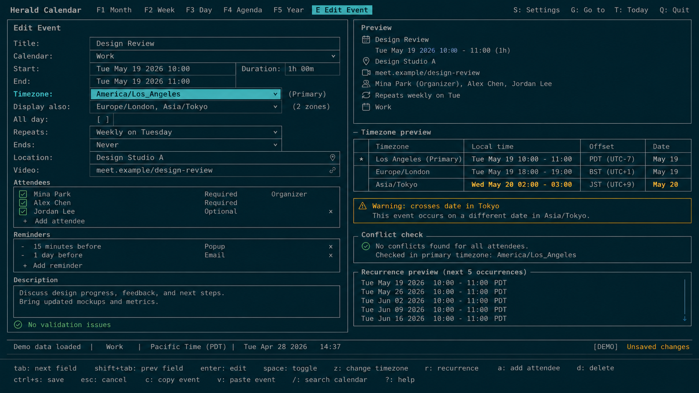

# Calendar TUI Roadmap

This spec captures the exploratory direction for a Herald calendar surface. It keeps the work at product-roadmap altitude so the team can choose slices later without prematurely committing to package boundaries, file edits, or engineering task breakdowns.

## Purpose

Calendar should become a first-class Herald workspace for understanding the day, navigating commitments, and acting on events with the same keyboard-first density as the mail timeline. The direction is not to clone a web calendar, but to translate the useful parts of Apple Calendar and Google Calendar into terminal-native views.

- [x] Users can switch into the read-only Calendar Agenda destination with the same confidence they switch between Herald mail tabs today.
- [x] Users can inspect an event without losing context, using a side detail panel when the surrounding schedule still matters.
- [x] Users can switch from Agenda List to a read-only Day Agenda with a persistent drawer for the selected event.
- [x] Users can switch from Agenda List or Day Agenda to a read-only Week Time-Grid with an inspector for the selected event.
- [x] Users can switch to a read-only 3-Day Command view that bridges today, tomorrow, and the next day with a command panel.
- [x] Users can open a full event detail view when they need the whole record: attendees, location, notes, RSVP state, recurrence, attachments, and timezone conversions.
- [x] Users can edit event time, timezone, attendees, reminders, recurrence, and location without leaving the TUI.
- [x] Users can reason about cross-timezone meetings before saving changes.
- [ ] Calendar remains visually consistent with Herald: dense tables, thin bordered panels, bottom key hints, compact status strips, and theme-aware highlights.

## Reference Mockups

These images are reference material only. They sit next to this spec so future planning can compare proposed slices against the intended interaction shape before any code is written.

## Product Shape

The calendar surface should feel like a peer to Timeline, Compose, Cleanup, and Contacts rather than a separate mini-app. It can start as a new top-level mode, then grow into a cross-source command center once the source identity and calendar provider foundation are ready.

- [x] Calendar appears as a durable navigation destination, not a transient overlay.
- [x] View switching is explicit and fast between Agenda List and Day Agenda.
- [x] View switching is explicit and fast between Agenda List, Day Agenda, and Week Time-Grid.
- [x] View switching is explicit and fast between Agenda List, Day Agenda, Week Time-Grid, and 3-Day Command.
- [ ] View switching is explicit and fast for Month, Week, 3-Day, and Search.
- [x] The active Day Agenda owns the center of the screen while a side drawer provides selected-event context and timezone labels.
- [x] The active Week Time-Grid owns the center of the screen while a side inspector provides selected-event context and timezone labels.
- [x] The active 3-Day Command view owns the center of the screen while a side command panel summarizes selected event, next-up, conflicts, and open slots.
- [x] Calendar Search filters cached calendar events across configured calendar sources while keeping selected-event detail and provider internals hidden.
- [x] Cross-source Search blends cached mail and calendar event results in a read-only command-center foundation while keeping Calendar Search event-only.
- [ ] Future spatial views add side panels for mini month, calendar filters, richer timezone preview, conflicts, and selected event details.
- [x] Event detail uses Herald's reader pattern: nearby items on one side, the selected record in a structured detail surface.
- [x] Event editing uses Herald's form/settings pattern: focused fields, compact controls, validation rows, and a live preview.
- [x] The minimum useful calendar experience works in demo mode before any live provider is required.

## Core Views

The first product decision is which views deserve first-class status and which views can wait. The five selected exploration directions below should be treated as the candidate core, with event editing as a required companion rather than a separate luxury feature.

| View | Primary Job | Detail Pattern | Product Role |
| --- | --- | --- | --- |
| Week Time-Grid | See the whole work week and spot conflicts or free blocks. | Right inspector for the selected block. | Best default for users who think spatially. |
| Day Agenda + Drawer | Move through today with fast keyboard navigation. | Persistent side drawer with notes and timezone conversions. | Best focused daily command view. |
| 3-Day Command | Bridge today, tomorrow, and the next day without the full-week noise. | Right command panel for next-up, conflicts, and open slots. | Best terminal-native differentiator. |
| Agenda List | Scan upcoming events like an email timeline. | Right preview panel for selected event metadata. | Best first product-slice candidate because it maps to Herald tables. |
| Event Detail | Read a complete event record. | Full-screen reader/editor-adjacent layout. | Required before confident editing and RSVP workflows. |
| Event Edit + Timezones | Change event fields safely. | Form plus live timezone preview. | Required before mutations leave demo-only territory. |

## Timezone Experience

Timezone support should be visible, not hidden in a settings corner. Users scheduling across regions need to know what an event means in local time, organizer time, and attendee-relevant time before they accept or save changes.

- [x] Every event detail view shows the event's canonical timezone and the user's local rendering when they differ.
- [x] Event editing includes a primary timezone field near start/end time, not buried under advanced options.
- [ ] Users can add secondary display timezones such as `Europe/London` and `Asia/Tokyo`.
- [x] The edit preview flags date-crossing cases, such as a Tuesday meeting becoming Wednesday in Tokyo.
- [x] Timezone changes update start/end interpretation clearly so users do not accidentally shift an event by changing display timezone.
- [x] The UI distinguishes timezone display from event mutation: viewing another timezone is safe, saving a new event timezone is explicit.

## Evolutionary Stages

The roadmap should evolve from useful read-only surfaces toward confident event mutation. Each stage should be independently valuable and should preserve Herald's existing mail behavior while calendar support matures.

- [ ] Stage 0: Product alignment. Keep this spec, the mockups, and the existing source-platform architecture aligned before choosing a first work slice.
- [x] Stage 1: Demo-mode calendar shell. Add static/demo events and view-switching prototypes so layout, key hints, and navigation can be judged without provider auth.
- [x] Stage 2: Agenda-first read-only calendar. Ship a cache-backed Agenda List and Event Detail path because those map cleanly to Herald's existing timeline and reader patterns.
- [x] Stage 3: Spatial schedule views. Add Day Agenda + Drawer, then Week Time-Grid, after the event model and render constraints are proven by the list view.
  - [x] Stage 3A: Add read-only Day Agenda + Drawer with Agenda/Day switching, day navigation, selected-event drawer details, and full detail preservation.
  - [x] Stage 3B: Add Week Time-Grid after Day view resize behavior and event selection are proven.
- [x] Stage 4: 3-Day Command view. Introduce the more distinctive planning surface once Day and Week data are reliable and conflict/open-slot summaries have a real backing model.
- [x] Stage 4A: Calendar Search foundation. Add read-only cache-backed event search across title, notes, location, organizer, attendee, recurrence, attachment, and source labels before mutation UI.
- [ ] Stage 5: Event editing with timezone safety. Add create/edit flows only after read-only detail, recurrence display, attendee display, and timezone rendering are trustworthy.
  - [x] Stage 5A: Prove full read-only Event Detail with attendees, organizer, RSVP state, recurrence, attachments, canonical timezone, and alternate timezone rendering before mutation UI.
  - [x] Stage 5B: Add a local/cache-backed Event Edit form with explicit save/cancel state and timezone preview before live provider mutation writes.
- [ ] Stage 6: Provider mutations and RSVP. Enable live updates, RSVP changes, recurrence edits, and provider-specific conflict handling after the local edit model is stable.
  - [x] Stage 6A: Add provider-backed Event Edit save-through and RSVP response changes with cache update after provider success, explicit failure state, and `this event` recurrence scope only.
  - [x] Stage 6B: Add typed provider conflict handling and explicit recurrence-scope validation so stale revisions and unsupported broader recurrence edits never rewrite cached event rows.
  - [x] Stage 6C: Add selected attendee-list and this-event recurrence-rule edits to Event Edit while reminders and broader recurrence-scope edits stay deferred.
  - [x] Stage 6D: Add selected reminder override edits to Event Edit while create-event flows and broader recurrence-scope edits stay deferred.
- [ ] Stage 7: Cross-source command center. Blend mail and calendar context: meeting prep from related emails, travel buffers from messages, and AI summaries over calendar plus inbox.
  - [x] Stage 7A: Add read-only Cross-Source Search over cached mail and calendar event rows before command-center summaries or mutations.

## Stage Gates

These gates define what must be true before moving from one evolutionary stage to the next. They are intentionally high-level acceptance signals, not test cases or task steps.

- [x] A read-only stage is acceptable only when users can navigate events, open detail, return without losing position, and understand which calendar each event belongs to.
- [x] The Day Agenda spatial slice is acceptable only when terminal resize behavior remains understandable at wide, standard, and narrow sizes.
- [x] The full spatial-view stage is acceptable only when Day Agenda and Week Time-Grid resize behavior remain understandable at wide, standard, and narrow sizes.
- [x] A timezone detail foundation is acceptable only when read-only Event Detail renders at least local time, event timezone, and one alternate timezone without ambiguity.
- [x] A calendar search stage is acceptable only when results are cache-backed, source-scoped, detail-preserving, and free of provider internals.
- [x] A timezone edit stage is acceptable only when event edit views render at least local time, event timezone, and one alternate timezone without ambiguity.
- [x] A mutation stage is acceptable only when unsaved changes, save success, provider failure, recurrence scope, and timezone shifts are explicit to the user.
- [ ] A provider stage is acceptable only when cache-first behavior, stale-result protection, and source/account identity are already boring.
- [x] A cross-source stage is acceptable only when calendar work does not degrade core mail timeline, compose, cleanup, contact, SSH, or MCP behavior.

## Product Dependencies

Calendar will be easier and safer if it builds on the source identity and cache-first direction already described in the source platform architecture spec. The calendar UI should not get ahead of the identity and provider foundations that make multi-source data safe.

- [x] Reuse the source/account/collection direction from `docs/superpowers/specs/2026-05-22-source-platform-architecture.md`.
- [x] Treat `EventRef` as the calendar equivalent of a scoped message reference before live provider reads become user-visible.
- [x] Keep provider details such as Google event IDs, CalDAV URLs, ETags, sync tokens, recurrence IDs, and revisions out of the TUI.
- [x] Let Herald own cache-first reads, in-flight coalescing, stale-result filtering, and visible-work priority.
- [x] Preserve demo mode as the design lab for calendar UI, just as it already supports mail screenshots and tapes.
- [x] Defer live event mutation until source identity, cache freshness, timezone rendering, and detail surfaces are all proven.

## Design Principles

The calendar should use terminal-native interaction instead of pretending to be a pixel-perfect web calendar. The best version borrows the conceptual affordances of modern calendar apps while keeping Herald's fast, inspectable, keyboard-first character.

- [ ] Prefer compact tables and grids over card-heavy layouts.
- [ ] Prefer side drawers for contextual inspection and full-screen detail for complete event reading.
- [ ] Prefer visible keyboard hints over hidden command discovery.
- [ ] Prefer explicit state labels such as `Accepted`, `Tentative`, `Conflict`, `Local`, and `Event TZ`.
- [x] Prefer deterministic text renderings of recurrence and timezone changes before introducing richer visual shortcuts.
- [ ] Prefer graceful minimum-size behavior over trying to preserve every column in tiny terminals.

## Non-Goals

This roadmap does not require every calendar idea to ship, and it does not define task-level work. It is a selection map for later planning sessions.

- [ ] Do not build all views in one engineering effort.
- [ ] Do not start with provider mutation UI before read-only detail and timezone rendering are proven.
- [ ] Do not add Apple Calendar or Google Calendar branding, layout chrome, or visual metaphors that do not fit Herald.
- [ ] Do not make calendar support depend on a remote provider for demo, documentation, or first visual validation.
- [ ] Do not replace existing mail tabs or keybindings without a separate navigation design decision.
- [ ] Do not turn this document into a low-level plan; later task plans should be written only after a stage is selected.

## Open Decisions

These are the product choices to make before the next planning pass. They should be answered when the team picks a stage, not resolved by this exploratory roadmap.

- [x] Decide whether Calendar is a new top-level tab or part of a broader future Sources workspace.
- [x] Decide whether Agenda List or Day Agenda is the first user-facing slice.
- [x] Decide whether Google Calendar, CalDAV, or demo-only data should be the first provider-backed surface.
- [x] Decide how calendar keybindings coexist with Timeline, Compose, Cleanup, Contacts, chat, folders, and settings.
- [ ] Decide how much recurrence editing belongs in the first mutation stage.
- [ ] Decide whether meeting-prep features should live in Calendar, AI Chat, or a later unified command view.
